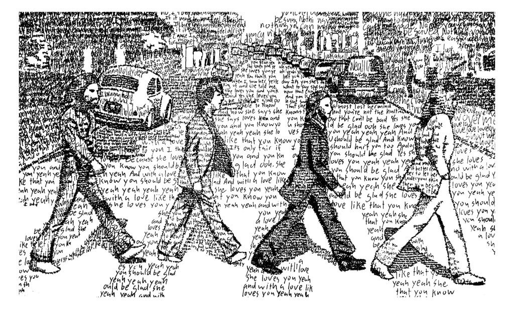
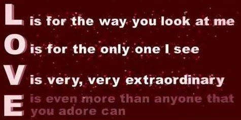

>*Telling the story of The Times with Lyrics*

<center>
 
</center>  
\
\

1. The Theme of the Times
---------------------------------------

```{r load libraries, warning=FALSE, message=FALSE,echo=FALSE}
library(data.table)
library(dplyr)
library(ngram)
library(tidytext)
library(tidyverse)
library(tidyr)
library(widyr) #Use for pairwise correlation
library(textdata)
library(DT)
library(tm)
library(scales)
library(topicmodels)
library(reshape2)
library(stringr)

#Visualizations!
library(plotly)
library(wordcloud2)
library(ggplot2) #Visualizations (also included in the tidyverse package)
library(ggrepel) #`geom_label_repel`
library(gridExtra) #`grid.arrange()` for multi-graphs
library(knitr) #Create nicely formatted output tables
library(kableExtra) #Create nicely formatted output tables
library(formattable) #For the color_tile function
library(circlize) #Visualizations - chord diagram
#library(memery) #Memes - images with plots
library(magick) #Memes - images with plots (image_read)
library(yarrr)  #Pirate plot
library(radarchart) #Visualizations
library(igraph) #ngram network diagrams
library(ggraph) #ngram network diagrams

#Define some colors to use throughout
my_colors <- c("#E69F00", "#56B4E9", "#009E73", "#CC79A7", "#D55E00", "#D65E00")

#Customize ggplot2's default theme settings
#This tutorial doesn't actually pass any parameters, but you may use it again in future tutorials so it's nice to have the options
theme_lyrics <- function(aticks = element_blank(),
                         pgminor = element_blank(),
                         lt = element_blank(),
                         lp = "none")
{
  theme(plot.title = element_text(hjust = 0.5), #Center the title
        axis.ticks = aticks, #Set axis ticks to on or off
        panel.grid.minor = pgminor, #Turn the minor grid lines on or off
        legend.title = lt, #Turn the legend title on or off
        legend.position = lp) #Turn the legend on or off
}

#Customize the text tables for consistency using HTML formatting
my_kable_styling <- function(dat, caption) {
  kable(dat, "html", escape = FALSE, caption = caption) %>%
  kable_styling(bootstrap_options = c("striped", "condensed", "bordered"),
                full_width = FALSE)
}
```

```{r, warning=FALSE, message=FALSE,echo=FALSE}
load('../output/processed_lyrics.RData') 
dt_artist <- fread('../data/artists.csv')
names(dt_artist) <- c("artist", "Intro","Formed", "Members", "Origin" )
```

```{r combining data, warning=FALSE, message=FALSE,echo=FALSE}
dt_lyrics <- dt_lyrics %>%
  mutate(decade = 
           ifelse(dt_lyrics$year %in% 1970:1979, "1970s", 
           ifelse(dt_lyrics$year %in% 1980:1989, "1980s", 
           ifelse(dt_lyrics$year %in% 1990:1999, "1990s", 
           ifelse(dt_lyrics$year %in% 2000:2009, "2000s", 
           ifelse(dt_lyrics$year %in% 2010:2017, "2010s", 
                  "NA"))))))  %>%
  inner_join(dt_artist, by = "artist") %>%
  select(song,
         year,
         decade,
         genre, 
         lyrics,
         stemmedwords,
         artist,
         Intro,
         Formed, 
         Members, 
         Origin) %>%
  mutate(count = sapply(dt_lyrics$stemmedwords, wordcount))
```


```{r substractung data, warning=FALSE,  message=FALSE,echo=FALSE}
dt_lyrics.19century <- filter(dt_lyrics,  year == 1970:1999)
dt_lyrics.20century <- filter(dt_lyrics,  year == 2000:2017)

dt_lyrics <- filter(dt_lyrics,  year == 1970:2017)
dt_lyrics.70 <- filter(dt_lyrics,  decade == "1970s")
dt_lyrics.80 <- filter(dt_lyrics,  decade == "1980s")
dt_lyrics.90 <- filter(dt_lyrics,  decade == "1990s")
dt_lyrics.00 <- filter(dt_lyrics,  decade == "2000s")
dt_lyrics.10 <- filter(dt_lyrics,  decade == "2010s")

dt_lyrics$status <- ifelse(dt_lyrics$decade == "1970s", "Lyrics in 1970s",
           ifelse(dt_lyrics$decade == "1980s", "Lyrics in 1980s", 
           ifelse(dt_lyrics$decade == "1990s", "Lyrics in 1990s", 
           ifelse(dt_lyrics$decade == "2000s", "Lyrics in 2000s", 
           ifelse(dt_lyrics$decade == "2010s", "Lyrics in 2010s", 
                  "NA")))))

```


According to the lyrics data collecting from 1970 to 2016, I divided the dataset into the 19th and 20th centuries lyrics, in order to do a evaluation of the most frequently used words in the 2 different set of lyrics.

First, I visualize the word cloud of top 200 used words of the whole dataset.
<center>
```{r, warning=FALSE, message=FALSE,echo=FALSE}

wordcount1 <- dt_lyrics$stemmedwords %>% 
  lapply(strsplit," ") %>% 
  unlist() %>% 
  table() %>% 
  as.data.frame()

colnames(wordcount1) <- c("Keyword","Freq")

sorted <- wordcount1 %>% dplyr::arrange(desc(Freq))

png(filename = ".../output/wordcloud1.png")

wordcloud2(sorted[1:200,],color = "random-light",size = 0.8,shape ="circle")

```
</center>

Then, I draw most frequently used words in lyrics histogram in 19th century to  make comparison with 20th century.

<center>
```{r,warning=FALSE,  message=FALSE,echo=FALSE}
wordcount1 <- dt_lyrics.19century$stemmedwords %>% 
  lapply(strsplit," ") %>% 
  unlist() %>% 
  table() %>% 
  as.data.frame()

colnames(wordcount1) <- c("Keyword","Freq")

sorted_s <- wordcount1 %>% dplyr::arrange(desc(Freq))

keywords20 <- head(sorted_s, n=10)

ggplot(keywords20,aes(fill=keywords30$Keyword)) +
  geom_bar(aes(x=keywords20$Keyword,y=keywords20$Freq),stat='identity',fill="light pink")+
  labs(title = "Most Frequently Used Words in Lyrics in 19th century", x="Words",y = "Frequency")+
  theme(axis.text.x = element_text(angle=65, vjust=0.6)) +
  scale_x_discrete(limits= keywords20$Keyword) + 
  guides(fill=FALSE)

```
</center> 

**Love, Baby, Time**, these three words are the words that people mostly like to write in the lyrics in the last century. In addition, the theme of the lyrics is related to meaningful and positive themes: **life, heart, day, mind, run** and **ill** is the only negative word in top10 keywords. If the lyrics can reflect the condition and mood of life, I think people in the last century will enjoy life and feel relaxed.

Let's see what happens to the theme words of the 20th century.
 

<center>

```{r,warning=FALSE, message=FALSE, echo=FALSE}
wordcount1 <- dt_lyrics.20century$stemmedwords %>% 
  lapply(strsplit," ") %>% 
  unlist() %>% 
  table() %>% 
  as.data.frame()

colnames(wordcount1) <- c("Keyword","Freq")

sorted_s <- wordcount1 %>% dplyr::arrange(desc(Freq))

keywords20 <- head(sorted_s, n=10)

ggplot(keywords20,aes(fill=keywords30$Keyword)) +
  geom_bar(aes(x=keywords20$Keyword,y=keywords20$Freq),stat='identity',fill="light blue")+
  labs(title = "Most Frequently Used Words in Lyrics in 20th century", x="Words",y = "Frequency")+
  theme(axis.text.x = element_text(angle=65, vjust=0.6)) +
  scale_x_discrete(limits= keywords20$Keyword) + 
  guides(fill=FALSE)
```
</center>
\
\
As we can see, **love** seems to be the most popular topic whenever we are, it accounts for more than twice as many other words. Unlike the last century, some meaningful words such as **time, day, life, ill, night** have increased which shows that people’s life and work pressure have increased in this century. Besides the percentage of **youre, ive** also improved maybe because the lyrics prefer to write songs that reflect everyday life, or the genre of music that people like has changed.

2. Interesting finding according to lyrics during times
---------------------------------------
### 2.1 The most prolific years
<center>
```{r, warning=FALSE, message=FALSE, echo=FALSE}
songs_year <- dt_lyrics %>%
  select(song, year) %>%
  group_by(year) %>%
  summarise(song_count = n())

id <- seq_len(nrow(songs_year))
songs_year <- cbind(songs_year, id)
label_data = songs_year
number_of_bar = nrow(label_data) #Calculate the ANGLE of the labels
angle = 90 - 360 * (label_data$id - 0.5) / number_of_bar #Center things
label_data$hjust <- ifelse(angle < -90, 1, 0) #Align label
label_data$angle <- ifelse(angle < -90, angle + 180, angle) #Flip angle
ggplot(songs_year, aes(x = as.factor(id), y = song_count)) +
  geom_bar(stat = "identity", fill = alpha("purple", 0.5)) +
  geom_text(data = label_data, aes(x = id, y = song_count + 10, label = year, hjust = hjust), color = "black", alpha = 0.6, size = 3, angle =  label_data$angle, inherit.aes = FALSE ) +
  coord_polar(start = 0) +
  ylim(-220, 1450) + #Size of the circle
  theme_minimal() +
  theme(axis.text = element_blank(),
        axis.title = element_blank(),
        panel.grid = element_blank(),
        plot.margin = unit(rep(-4,4), "in"),
        plot.title = element_text(margin = margin(t = 10, b = -10)))
```
</center>
From the graph I found that the most prolific years is 2006 and 2007, which is over many times than other years, this is marks the beginning of the era of pop music.
I'll give more specific data to show the count of songs per year.
 
 
<center>
```{r, warning=FALSE, message=FALSE, echo=FALSE}
sorted_song <- songs_year %>% 
  dplyr::arrange(desc(song_count))
sorted_song <- head(sorted_song,5)
sorted_song %>%
  mutate(song_count = color_tile("lightblue", "lightblue")(song_count),
         year = color_bar("lightpink")(year)) %>%
  my_kable_styling(caption = "Songs Counts Per Year")
```
</center>
   
  
### 2.2 The most longest lyrics
 
  
According to the previous analysis, the proportion of some modal verbs such like **"youre, ive"** in the lyrics is slightly increasing, which may reflect that modern literati prefer to write daily lyrics.  
For further verification, I divided the data set into five data sets by decades and statistic the length of the lyrics for five decades from 1970s to 2010s.
 
 
```{r, warning=FALSE, message=FALSE, echo=FALSE}
ggplot(dt_lyrics, aes(count, status, color = status)) +
  geom_point() + 
  geom_jitter(width = 1.0, height = 0.3) + 
  ggtitle("Length of Lyrics for Five Decades") +
  labs(x = "Length of Sentences")
```
Although the datasets of each age are unevenly distributed, I can still get some conclusions. The length of the lyrics is getting longer as the times go by, there are essential changes from the 19th century to the 20th century. The previous lyrics are more written, concise, refined and now lyrics are more routine and daily.  


### 2.3 Lexical Diversity and Density

The more varied a vocabulary a text possesses, the higher its lexical diversity. Song Vocabulary is a representation of how many unique words are used in a song.  
And lexical density is defined as the number of unique words divided by the total number of words. This is an indicator of word repetition, which is a critical songwriter's tool. As lexical density increases, repetition decreases.  
I plot the two graphs together in order to compare it to diversity and density.  


```{r, warning=FALSE, message=FALSE, echo=FALSE}

lex_diversity_per_year <- dt_lyrics %>%
  filter(decade != "NA") %>%
  unnest_tokens(stemmedwords, lyrics) %>%
  group_by(song,year) %>%
  summarise(lex_diversity = n_distinct(stemmedwords)) %>%
  arrange(desc(lex_diversity)) 

diversity_plot <- lex_diversity_per_year %>%
  ggplot(aes(year, lex_diversity)) +
    geom_point(color = my_colors[3],
               alpha = .4, 
               size = 4, 
               position = "jitter") + 
    stat_smooth(color = "black", se = FALSE, method = "lm") +
    geom_smooth(aes(x = year, y = lex_diversity), se = FALSE,
                color = "blue", lwd = 2) +
    ggtitle("Lexical Diversity") +
    xlab("") + 
    ylab("") +
    scale_color_manual(values = my_colors) +
    theme_classic() + 
    theme_lyrics()

lex_density_per_year <- dt_lyrics%>%
  filter(decade != "NA") %>%
  unnest_tokens(stemmedwords, lyrics) %>%
  group_by(song,year) %>%
  summarise(lex_density = n_distinct(stemmedwords)/n()) %>%
  arrange(desc(lex_density))

density_plot <- lex_density_per_year %>%
  ggplot(aes(year, lex_density)) + 
    geom_point(color = my_colors[1],
               alpha = .4, 
               size = 4, 
               position = "jitter") + 
    stat_smooth(color = "black", 
                se = FALSE, 
                method = "lm") +
    geom_smooth(aes(x = year, y = lex_density),
                se = FALSE,
                color = "blue", 
                lwd = 2) +
    ggtitle("Lexical Density") + 
    xlab("") + 
    ylab("") +
    scale_color_manual(values = my_colors) +
    theme_classic() + 
    theme_lyrics()

grid.arrange(diversity_plot, density_plot, ncol = 2)

```
From the above, there is a slight increase in lexical diversity and obvious decrease in lexical density over the decades. This shows that the current lyrics are more diversity, and the repetition of the lyrics has decreased.


3. Sentiment Analysis
---------------------------------------

I will measure the sentiments of song lyrics in 5 different decades to make comparison. 
Bing lexicon assigns words to positive and negative categories. 
AFINN lexicon assign each word with a score from -5 to 5 where higher score means more positive sentiment. 

I will use the Bing lexicon as an example.

```{r,echo = FALSE, results='hide',warning=FALSE, message=FALSE}

bing <- function(df){
  tokens <- data_frame(df$stemmedwords) %>% unnest_tokens(word, df$stemmedwords)
  
  sentiment <- tokens %>%
  inner_join(get_sentiments("bing")) %>% # pull out the sentiment words 
  count(sentiment) %>%   # count the number of positive and negative words
  spread(sentiment, n, fill = 0) %>% 
  mutate(sentiment = positive/negative) 
  
  return(sentiment)
}

bing.70 <- bing(dt_lyrics.70)$sentiment
bing.80 <- bing(dt_lyrics.80)$sentiment
bing.90 <- bing(dt_lyrics.90)$sentiment
bing.00 <- bing(dt_lyrics.00)$sentiment
bing.10 <- bing(dt_lyrics.10)$sentiment

bing.vec <- data.frame(bing = c(bing.70, bing.80,bing.90,bing.00,bing.10))
```

```{r, warning=FALSE, message=FALSE, echo=FALSE}
demo.vec <- c("Lyrics in 1970s", "Lyrics in 1980s", "Lyrics in 1990s", "Lyrics in 2000s","Lyrics in 2010s")
both <- cbind(demo.vec,  bing.vec)
colnames(both) <- c('Lyrics_Groups', 'bing')
both

melt.sentiments <- melt(both, id.vars = "Lyrics_Groups")
ggplot(melt.sentiments, aes(variable, value)) +
  geom_bar(aes(fill = Lyrics_Groups), position = "dodge", stat = "identity")
```
The sentiment score of bing lexicon is the amount of positive words divided by negative words. The results show that lyrics in 1990s have a significantly higher score than lyrics in 2000s and 19th century's lyrics are more positive than 20th century obviously which verifies my previous inferences that people's life become more stressful and struggle.  
 
Another interesting discovery is the 2 decades(1980s and 2000s) with the lowest scores, which happened to be the time when the US financial crisis occurred: The Black Monday, which swept the global stock market in 1987 and US Subprime Mortgage Crisis from 2007 to 2009. Thus, the enthusiasm of the lyrics reflects the economic situation of the times.


4. Topic Modeling
---------------------------------------
 
I will extract topics with fitting a LDA model. We tried setting the numbers of topics as three to six. It turns out that setting three topics number make the most sense. The beta matrix tells us the probabilities of each word being generated from each topic.  
  

```{r,warning=FALSE, message=FALSE, echo=FALSE}
order.data.19century <- dt_lyrics.19century[order(dt_lyrics.19century$year),]
order.data.19century$status <- ifelse(order.data.19century$genre == "Rock", 1, 2)
order.data.20century <- dt_lyrics.20century[order(dt_lyrics.20century$year),]
order.data.20century$status <- ifelse(order.data.20century$genre == "Rock", 3, 4)

combine <- rbind(order.data.19century,order.data.20century)

combine.data <- combine  %>% 
                group_by(year) %>% 
                summarise(stemmedwords = paste(stemmedwords, collapse = " "), status = mean(status))

combine.docs <- Corpus(VectorSource(combine.data$stemmedwords))
dtm.combine <- DocumentTermMatrix(combine.docs)

lda <- LDA(dtm.combine, k = 3, method = "GIBBS", control = list(seed = 2))
```

```{r,warning=FALSE, message=FALSE, echo=FALSE}
# the beta matrix 
topics <- tidy(lda, matrix = "beta")
head(topics,9)
```
  
  
The word "admire"" is generated from the topic 1 with a probability of 1.570543e-04, and the word "america" takes account 7.230157e-04.  
Then I visualized the top ten most frequent words in each topics. 


```{r,warning=FALSE, message=FALSE, echo=FALSE}
#Find the top ten words in each topic. 
top.words <- topics %>%
  group_by(topic) %>%
  top_n(10, beta) %>%
  ungroup() %>%
  arrange(topic, -beta)

top.words %>%
  mutate(term = reorder(term, beta)) %>%
  ggplot(aes(term, beta, fill = factor(topic))) +
  geom_col(show.legend = FALSE) +
  facet_wrap(~ topic, scales = "free") +
  coord_flip()
```
The top ten words has become more different than theme topic, there are many new words such as "eyes","free","gril" related to each topic.

5. Conclusion
---------------------------------------
Lyrics can bring us a lot of thinking through data analysis, text mining and statistics.  

The lyrics can reflect the changes and progress of the times, the happiness and the pressure of people's lives. More deeply, the lyrics can reflect the economic state of society and even the country, people's material life and cultural preferences.  

**But no matter how the times change, the most important theme in the lyrics is always love.**


<center>
 


</center>
  
  
  